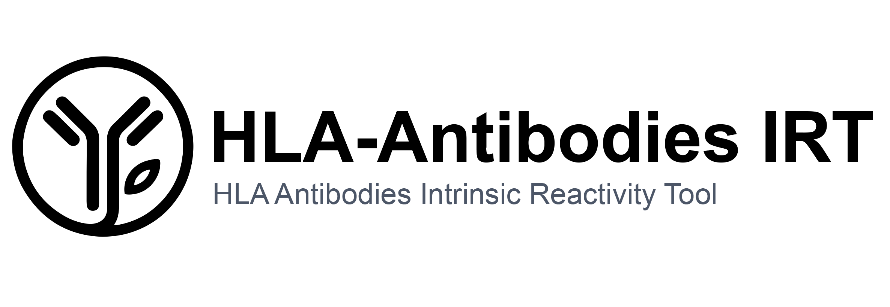
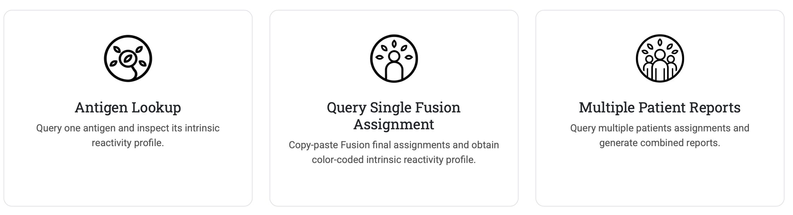
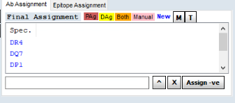
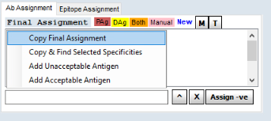

<p align="center">
  
</p>

---

## Overview

[HLA-Antibodies IRT](https://mallonelabimmunotools.shinyapps.io/hla_unspecificity_app/) is an interactive tool designed to support the interpretation of HLA single antigen bead (SAB) assay results by identifying assay-intrinsic reactivity patterns. Interpretation of SAB assays is often complicated by background reactivity and assay-specific artifacts, particularly when relying solely on MFI thresholds. This may lead to overestimation of sensitization and unnecessary restriction of donor compatibility. Interpretation of SAB assays is often complicated by background reactivity and assay-specific artifacts, particularly when relying solely on MFI thresholds. This may lead to overestimation of sensitization and unnecessary restriction of donor compatibility.

This tool addresses this challenge by integrating multiple orthogonal dimensions of evidence:

- Background reactivity observed in non-immunized reference cohorts  
- Cross-platform discordance between One Lambda and Immucor assays  
- Longitudinal disappearance of antibody signals  

By combining these into a probabilistic framework, the application enables antigen-level intrinsic reactivity profiling. This approach supports improved discrimination between biologically meaningful antibodies and assay-intrinsic signals, facilitating more robust interpretation in transplantation immunology.

IMPORTANT: This tool is intended for research and educational purposes only. It is not a certified diagnostic device.

---

## Application interface

<p align="center">
  
</p>


The application is structured into three main workflows:

- **Antigen Lookup**  
  Query a single antigen and explore its intrinsic reactivity profile, including probability estimates, percentile ranking, and interpretation. This workflow is particularly useful in day-to-day clinical practice, allowing transplant specialists to rapidly assess the likelihood of assay-intrinsic reactivity for a given antigen and support allocation decisions.

- **Query Single Fusion Assignment**  
  Paste the output of Fusion “Final Assignment” and obtain an immediate color-coded interpretation of SAB antigen reactivity. This workflow is particularly helpful during routine monitoring of listed patients and supports the discrimination of true unacceptable antigens, directly impacting listing strategies and organ allocation decisions.

- **Multiple Patient Reports**  
  Sequentially paste Fusion “Final Assignment” outputs from multiple patients to generate combined summaries and downloadable reports. This workflow is especially useful for transplant immunology laboratories processing multiple waitlisted patients, enabling efficient batch-level interpretation.
---
## How to copy Fusion “Final Assignment”

To use the *Query Single Fusion Assignment* & *Multiple Patient Reports* workflows, the antigen assignments must be copied directly from the Fusion software or inserted manually. Antigens must follow standard HLA nomenclature (e.g. A80, B76, Cw14, DR53, DQ7, DP1).

### Steps

1. Open the patient sample in Fusion  
2. Navigate to the **“Ab Assignment”** tab  
3. Right-click anywhere in the table  
4. Select **“Copy Final Assignment”**  
5. Paste the content directly into the application  

### Example

<p align="center">
  
  
</p>

---

## Software and Reproducibility

The application is developed in **R** and relies on the following packages:  
*shiny, bslib, dplyr, ggplot2, openxlsx, readr, DT, stringr*


### Availability

The application is available as an interactive web tool:  
https://mallonelabimmunotools.shinyapps.io/hla_unspecificity_app/
The full source code and required data are available in this repository.


### Limitations

This tool does not replace expert laboratory interpretation.  
All outputs should be interpreted within the appropriate clinical context.

---

## Download and run locally


Click **Code → Download ZIP** on GitHub  
or clone:

```bash
git clone https://github.com/MalloneLab/HLA-AB-Intrinsic-Reactivity-Tool.git
